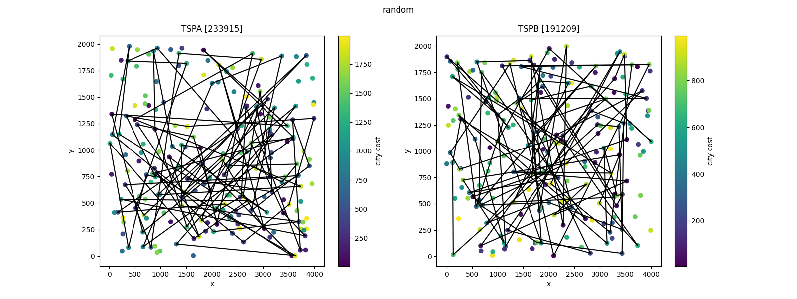
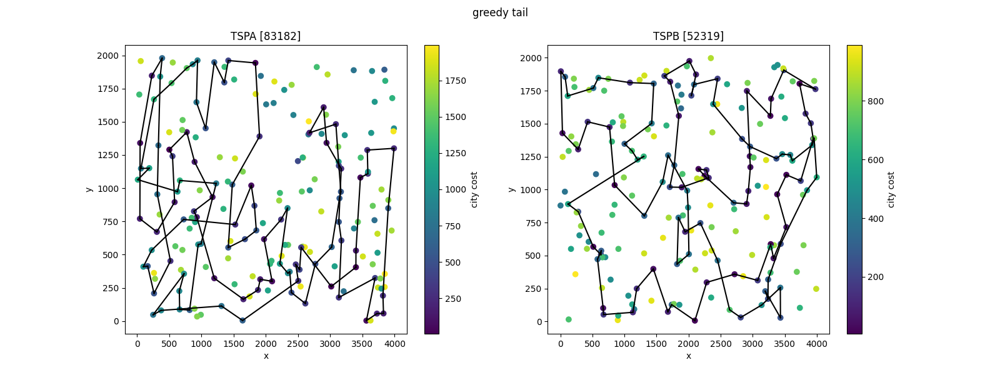
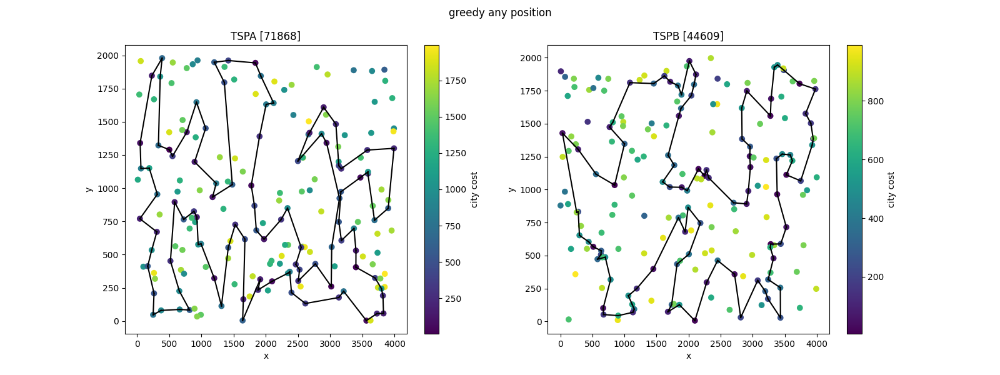
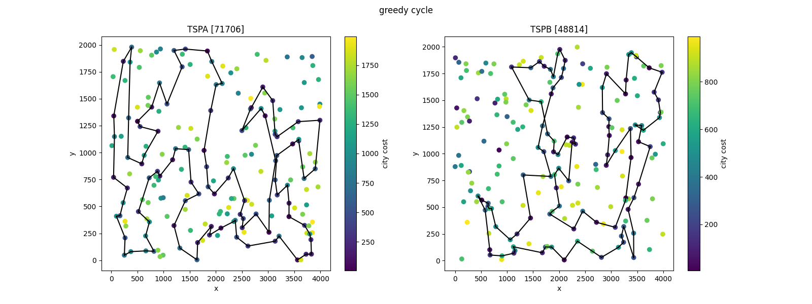
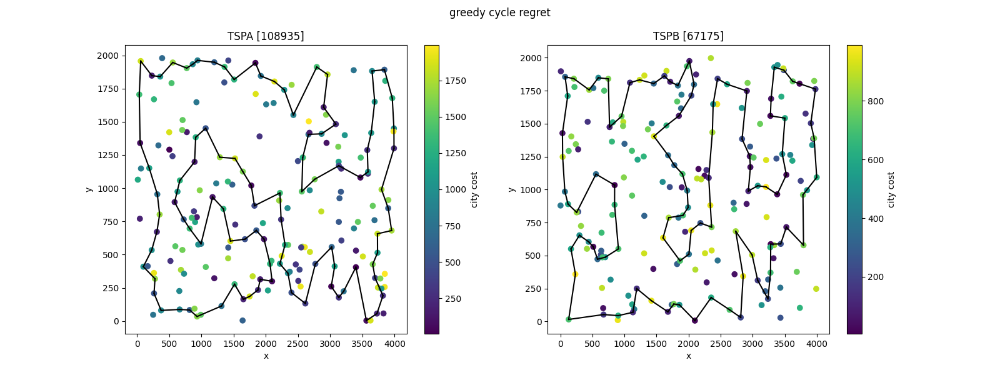
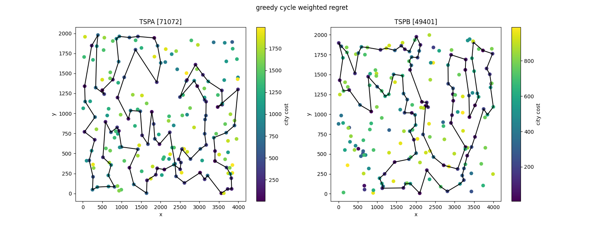
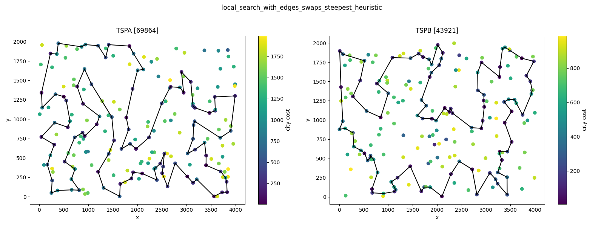
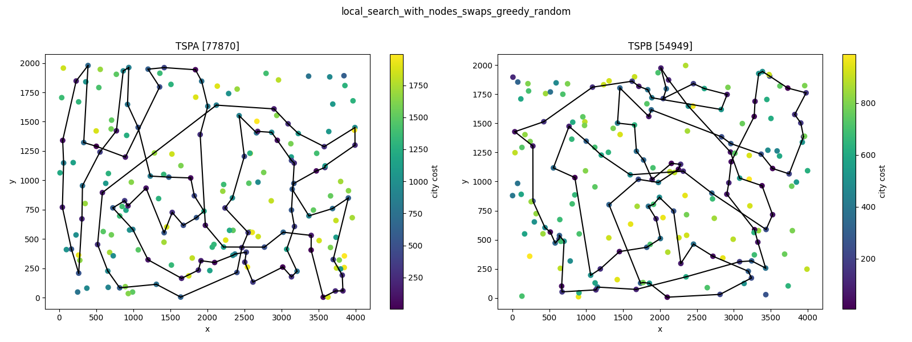
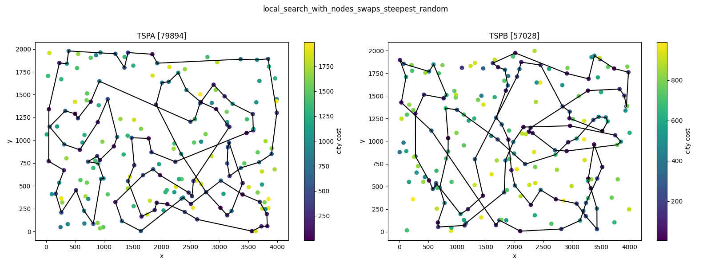
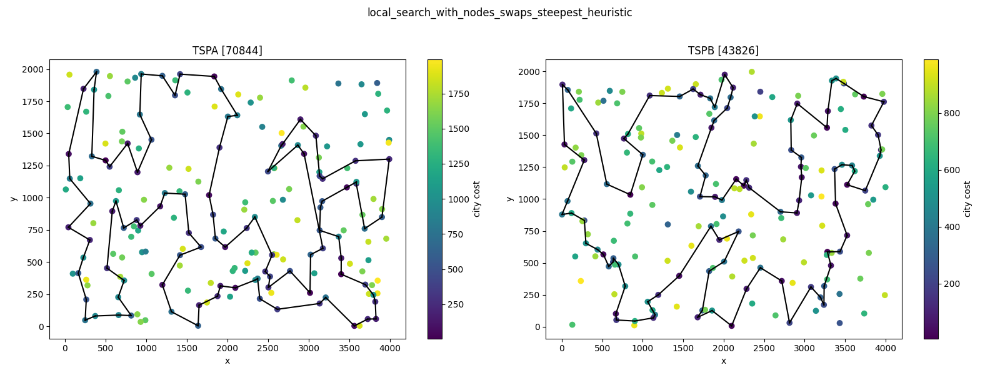

# Raport 3 - Local search [GITHUB](https://github.com/eeryczeek/evolutionary_computing)

Eryk Ptaszyński: 151950  
Eryk Walter: 151931

The **Traveling Salesman Problem (TSP)** is an optimization problem where the objective is to find the shortest possible route that visits a set of cities exactly once and returns to the starting city. In its traditional form, the TSP assumes that the cost of traveling between any two cities is known and fixed, and the salesman must visit all cities.

## Modified TSP Problem with Additional Constraints

1. **Additional City Cost**:  
   In this modified version, each city has an associated **fixed cost** (besides the cost of travel). This city cost represents an additional expense incurred for visiting the city. Therefore, the total cost of the route is the sum of the travel costs between cities and the individual costs for each visited city. The objective becomes minimizing the total of both travel costs and city costs.

2. **Selection of Only 50% of Cities**:  
   Another key modification is that the salesman is not required to visit **all** cities. Instead, the objective is to visit **exactly 50% of the available cities**. This creates a **sub-selection** problem where the salesman must decide which subset of cities to visit while minimizing the total cost (**travel + city cost**).

This visual representation provides an intuitive way to interpret the spatial relationships between cities, their associated fixed costs, and potential travel paths.


<div style="page-break-after: always;"></div>

## [Table of Contents](#table-of-contents)

1. [Modified TSP Problem with Additional Constraints](#modified-tsp-problem-with-additional-constraints)
2. [Combined TSPA and TSPB results table](#combined-tspa-and-tspb-results-table)
3. [Solutions](#solutions)
   - [Local search with edges swaps greedy](#local-search-with-edges-swaps-greedy)
   - [Local search with edges swaps steepest](#local-search-with-edges-swaps-steepest)
4. [Conclusions](#conclusions)

<div style="page-break-after: always;"></div>

## [Combined TSPA and TSPB results table](#combined-tspa-and-tspb-results-table):

Instance TSPA results table:

| **Method**                       | **Min** | **Mean** | **Max** | **Time\* (s)** |
| -------------------------------- | ------- | -------- | ------- | -------------- |
| `ls_edges_swaps_greedy_random`   | 71492   | 73710    | 76560   | 63.7732        |
| `ls_edges_swaps_steepest_random` | 71646   | 73914    | 78738   | 15.9961        |
| `ls_candidate_greedy_random`     | 75908   | 80351    | 85536   | 35.0503        |
| `ls_candidate_steepest_random`   | 77983   | 77983    | 77983   | 13.6452        |

Instance TSPB results table:

| **Method**                       | **Min** | **Mean** | **Max** | **Time\* (s)** |
| -------------------------------- | ------- | -------- | ------- | -------------- |
| `ls_edges_swaps_greedy_random`   | 46029   | 48352    | 51147   | 66.4630        |
| `ls_edges_swaps_steepest_random` | 46021   | 48303    | 50845   | 16.3699        |
| `ls_candidate_greedy_random`     | 44892   | 47775    | 50155   | 36.7747        |
| `ls_candidate_steepest_random`   | 47367   | 47367    | 47367   | 14.7428        |

**Time\* - to solve all 200 instances**

## Solutions

### [Random](#random)



### [Greedy tail](#greedy-tail)



### [Greedy any position](#greedy-any-position)



### [Greedy cycle](#greedy-cycle)



### [Greedy cycle regret](#greedy-cycle-regret)



### [Greedy cycle weighted regret](#greedy-cycle-weighted-regret)



## Local search pseudo code:

we have three possible moves in our implementation:

```
EdgeSwap(edge1: (Int, Int), edge2: (Int, Int))
NodeSwapOut(triplet: (Int, Int, Int), city: Int)
NodeSwapIn(triplet1: (Int, Int, Int), triplet2: (Int, Int, Int))
```

```
   def getNeighbourhoodWithEdgesSwapsIn() {
      pairs = all consecutive city pairs in the current cycle
      triplets = all consecutive city triplets in the current cycle
      edgeSwapsIn = all combinations of pairs with itself (without repetition)
      nodeSwapsOut = all combinations of triplets and all available cities not yet included in the solution
      edgeSwapsIn ++ nodeSwapsOut
   }

   def getNeighbourhoodWithNodesSwapsIn() {
      triplets = all consecutive city triplets in the current cycle
      nodesSwapsIn = all combinations of pairs with itself (without repetition)
      nodeSwapsOut = all combinations of triplets and all available cities not yet included in the solution
      nodesSwapsIn ++ nodeSwapsOut
   }
```

```
   def getGreedyImpovementMove() {
      firstImprovingMove = shuffle randomly all possible moves and take the first for which delta_cost < 0
   }

   def getSteepestImprovementMove() {
      bestImprovingMoves = map each move to the tuple (move, deltaCost), and take the one with minimal delta_cost
   }
```

<div style="page-break-after: always;"></div>

### [Local search with edges swaps greedy](#local-search-with-edges-swaps-greedy)


<div style="page-break-after: always;"></div>

### [Local serach with edges swaps steepet](#local-serach-with-edges-swaps-steepet)




<div style="page-break-after: always;"></div>

### [Local search with nodes swaps greedy](#local-search-with-nodes-swaps-greedy)




<div style="page-break-after: always;"></div>

### [Local search with nodes swaps steepest](#local-search-with-nodes-swaps-steepest)





## [Conclusions](#conclusions)

In conclusion, the results for instances TSPA and TSPB demonstrate that local search methods, particularly those guided by heuristic configurations, achieve superior solution quality for the TSP with efficient computation times. Methods like local_search_with_edges_swaps_greedy_heuristic and local_search_with_nodes_swaps_steepest_heuristic outperformed simpler approaches, yielding lower mean and minimum solution lengths without excessive time costs.

The analysis shows that integrating heuristic-driven local searches with edge and node swaps, especially in steepest descent and greedy settings, significantly improves solution efficiency. These hybrid approaches offer a practical balance of solution quality and computational feasibility, making them highly effective for complex TSP instances and large-scale optimization challenges.

The analysis further reveals that edge swaps generally outperform node swaps across both TSPA and TSPB instances in terms of solution quality and computational efficiency. Specifically, edge swap methods such as local_search_with_edges_swaps_greedy_heuristic and local_search_with_edges_swaps_steepest_heuristic consistently achieved lower mean and minimum solution lengths compared to their node swap counterparts, with comparable or shorter computation times. This advantage likely stems from edge swaps’ ability to make more targeted adjustments to the tour structure, effectively reducing total path length with fewer modifications, thereby enhancing both solution quality and efficiency in the search process.

```
Instance: tspa
Method: local_search_with_edges_swaps_greedy_random
Best Solution: Solution(List(101, 86, 75, 2, 120, 44, 25, 129, 92, 57, 55, 179, 145, 78, 16, 171, 175, 113, 31, 196, 81, 90, 27, 164, 95, 39, 165, 40, 185, 52, 106, 178, 49, 14, 144, 102, 62, 9, 148, 137, 23, 89, 183, 143, 117, 108, 18, 22, 146, 103, 34, 48, 54, 177, 10, 190, 4, 112, 84, 184, 160, 42, 181, 159, 193, 41, 139, 68, 46, 115, 116, 65, 47, 43, 131, 149, 59, 118, 51, 176, 80, 63, 79, 133, 151, 162, 123, 127, 70, 135, 154, 180, 53, 100, 26, 94, 124, 152, 97, 1),71492)

Instance: tspa
Method: local_search_with_edges_swaps_greedy_heuristic
Best Solution: Solution(List(196, 81, 90, 165, 119, 40, 185, 55, 52, 106, 178, 14, 144, 49, 102, 62, 9, 148, 124, 94, 63, 79, 133, 162, 151, 51, 80, 176, 137, 23, 186, 89, 183, 143, 117, 0, 46, 68, 108, 69, 18, 22, 146, 159, 193, 41, 139, 115, 118, 59, 65, 116, 43, 42, 181, 34, 160, 48, 54, 177, 10, 190, 4, 112, 84, 184, 35, 131, 149, 123, 127, 70, 135, 154, 180, 53, 100, 26, 86, 75, 101, 1, 97, 152, 2, 120, 44, 25, 16, 171, 175, 113, 56, 31, 78, 145, 92, 129, 57, 179),69620)

Instance: tspa
Method: local_search_with_edges_swaps_steepest_random
Best Solution: Solution(List(5, 42, 181, 34, 160, 48, 54, 177, 10, 190, 184, 84, 4, 112, 127, 123, 131, 149, 59, 118, 51, 176, 80, 151, 162, 133, 79, 63, 94, 180, 154, 135, 70, 158, 53, 100, 26, 97, 1, 101, 86, 75, 2, 152, 167, 57, 92, 129, 82, 120, 44, 25, 16, 171, 175, 113, 31, 78, 145, 179, 196, 81, 90, 27, 39, 165, 40, 185, 55, 52, 106, 178, 49, 14, 144, 62, 9, 148, 137, 89, 183, 143, 0, 117, 93, 108, 69, 18, 22, 159, 193, 41, 139, 68, 46, 115, 116, 65, 47, 43),71646)

Instance: tspa
Method: local_search_with_edges_swaps_steepest_heuristic
Best Solution: Solution(List(196, 81, 90, 165, 119, 40, 185, 106, 178, 14, 144, 49, 102, 62, 9, 148, 94, 63, 79, 133, 80, 176, 137, 23, 186, 89, 183, 143, 0, 117, 93, 140, 108, 69, 18, 22, 146, 159, 193, 41, 5, 42, 181, 34, 160, 48, 54, 177, 10, 190, 4, 112, 84, 35, 184, 43, 116, 65, 59, 118, 115, 139, 68, 46, 51, 151, 162, 123, 127, 70, 135, 154, 180, 53, 86, 100, 26, 97, 152, 1, 101, 75, 2, 120, 44, 25, 16, 171, 175, 113, 56, 31, 78, 145, 179, 92, 129, 57, 55, 52),69864)

Instance: tspa
Method: local_search_with_nodes_swaps_greedy_random
Best Solution: Solution(List(139, 140, 93, 68, 46, 118, 51, 176, 80, 122, 79, 133, 151, 162, 59, 65, 116, 43, 149, 123, 135, 154, 180, 53, 100, 26, 1, 101, 75, 120, 44, 25, 82, 92, 57, 106, 178, 49, 102, 62, 9, 15, 148, 124, 94, 152, 97, 86, 70, 127, 112, 84, 184, 42, 186, 144, 14, 138, 165, 27, 90, 119, 40, 185, 52, 55, 179, 196, 81, 31, 113, 175, 171, 16, 78, 145, 129, 2, 121, 63, 137, 23, 89, 183, 143, 117, 0, 115, 193, 159, 108, 18, 22, 146, 34, 54, 177, 160, 181, 41),77870)

Instance: tspa
Method: local_search_with_nodes_swaps_greedy_heuristic
Best Solution: Solution(List(68, 46, 115, 139, 41, 193, 159, 69, 108, 18, 22, 146, 181, 34, 160, 48, 54, 177, 10, 190, 4, 112, 84, 184, 131, 149, 43, 42, 116, 65, 59, 118, 51, 151, 133, 162, 123, 127, 70, 135, 154, 180, 53, 100, 26, 86, 75, 44, 25, 16, 171, 175, 113, 56, 31, 78, 145, 179, 57, 55, 52, 185, 119, 40, 196, 81, 90, 165, 106, 178, 14, 144, 62, 9, 148, 102, 49, 92, 129, 120, 2, 101, 1, 97, 152, 124, 94, 63, 79, 80, 176, 137, 23, 186, 89, 183, 143, 0, 117, 93),70917)

Instance: tspa
Method: local_search_with_nodes_swaps_steepest_random
Best Solution: Solution(List(75, 16, 171, 175, 113, 31, 78, 129, 101, 26, 70, 127, 123, 133, 79, 63, 97, 1, 152, 106, 178, 49, 62, 15, 114, 186, 23, 137, 124, 2, 120, 44, 25, 145, 52, 55, 57, 92, 179, 196, 81, 90, 164, 7, 21, 89, 183, 143, 0, 117, 108, 69, 18, 22, 34, 160, 48, 54, 177, 184, 84, 112, 131, 149, 47, 43, 116, 65, 59, 118, 46, 115, 42, 181, 146, 159, 193, 41, 139, 68, 148, 37, 9, 144, 14, 138, 165, 40, 185, 94, 80, 176, 51, 151, 162, 135, 154, 180, 53, 86),79894)

Instance: tspa
Method: local_search_with_nodes_swaps_steepest_heuristic
Best Solution: Solution(List(68, 46, 115, 139, 41, 193, 159, 69, 108, 18, 22, 146, 181, 34, 160, 48, 54, 177, 10, 190, 4, 112, 84, 35, 184, 42, 5, 43, 116, 65, 59, 118, 51, 151, 133, 162, 123, 127, 70, 135, 154, 180, 53, 100, 26, 86, 75, 44, 25, 16, 171, 175, 113, 56, 31, 78, 145, 179, 57, 55, 52, 185, 119, 40, 196, 81, 90, 165, 106, 178, 14, 144, 62, 9, 148, 102, 49, 92, 129, 120, 2, 101, 1, 97, 152, 124, 94, 63, 79, 80, 176, 137, 23, 186, 89, 183, 143, 0, 117, 93),70844)


Instance: tspb
Method: local_search_with_edges_swaps_greedy_random
Best Solution: Solution(List(164, 73, 136, 190, 80, 175, 78, 5, 177, 36, 61, 91, 141, 97, 77, 111, 41, 81, 153, 163, 89, 165, 127, 103, 113, 176, 194, 166, 86, 185, 179, 94, 47, 148, 60, 20, 28, 140, 183, 152, 34, 55, 18, 62, 124, 106, 159, 143, 35, 109, 0, 29, 144, 104, 8, 82, 87, 21, 25, 182, 138, 33, 160, 11, 139, 43, 168, 195, 13, 145, 15, 3, 70, 132, 169, 188, 6, 147, 71, 191, 90, 51, 121, 131, 122, 133, 10, 107, 40, 100, 63, 135, 38, 1, 156, 198, 117, 193, 31, 54),46029)

Instance: tspb
Method: local_search_with_edges_swaps_greedy_heuristic
Best Solution: Solution(List(40, 107, 133, 122, 135, 131, 121, 51, 90, 191, 147, 6, 188, 169, 132, 13, 70, 3, 15, 145, 195, 168, 139, 11, 138, 33, 160, 29, 0, 109, 35, 143, 106, 124, 62, 18, 55, 34, 170, 152, 183, 140, 4, 149, 28, 20, 60, 148, 47, 94, 66, 179, 185, 22, 99, 130, 95, 86, 166, 194, 176, 113, 103, 127, 89, 163, 187, 153, 81, 77, 141, 91, 36, 61, 21, 82, 8, 104, 177, 5, 45, 142, 78, 175, 162, 80, 190, 136, 73, 54, 31, 193, 117, 198, 156, 1, 16, 27, 38, 63),43758)

Instance: tspb
Method: local_search_with_edges_swaps_steepest_random
Best Solution: Solution(List(54, 73, 136, 190, 80, 5, 177, 21, 82, 61, 36, 91, 141, 77, 81, 153, 163, 89, 127, 103, 113, 180, 176, 194, 166, 86, 95, 130, 99, 22, 185, 179, 66, 94, 154, 47, 148, 60, 20, 28, 149, 4, 140, 183, 152, 170, 34, 55, 18, 62, 124, 106, 143, 111, 8, 104, 138, 11, 33, 160, 29, 0, 35, 109, 189, 155, 3, 70, 15, 145, 168, 195, 13, 132, 169, 188, 6, 147, 191, 90, 125, 51, 121, 112, 19, 131, 122, 135, 32, 63, 102, 38, 27, 16, 1, 156, 198, 117, 193, 31),46021)

Instance: tspb
Method: local_search_with_edges_swaps_steepest_heuristic
Best Solution: Solution(List(40, 107, 133, 122, 135, 131, 121, 51, 90, 191, 147, 6, 188, 169, 132, 13, 70, 3, 15, 145, 195, 168, 139, 11, 182, 138, 33, 160, 29, 0, 109, 35, 143, 106, 124, 62, 18, 55, 34, 170, 152, 183, 140, 4, 149, 28, 20, 60, 148, 47, 94, 66, 179, 22, 99, 130, 95, 185, 86, 166, 194, 176, 180, 113, 103, 114, 137, 127, 89, 163, 187, 153, 81, 77, 141, 91, 61, 36, 177, 5, 45, 142, 78, 175, 162, 80, 190, 136, 73, 54, 31, 193, 117, 198, 156, 1, 16, 27, 38, 63),43921)

Instance: tspb
Method: local_search_with_nodes_swaps_greedy_random
Best Solution: Solution(List(138, 160, 0, 109, 29, 33, 11, 139, 43, 134, 6, 168, 195, 34, 55, 95, 185, 179, 94, 47, 148, 60, 20, 28, 149, 4, 140, 183, 62, 124, 106, 176, 113, 114, 103, 163, 97, 36, 78, 175, 80, 190, 73, 54, 31, 193, 117, 198, 1, 135, 63, 122, 147, 188, 169, 132, 13, 170, 152, 184, 155, 145, 15, 70, 3, 189, 18, 128, 86, 166, 194, 143, 35, 182, 118, 51, 90, 131, 121, 45, 5, 177, 21, 82, 8, 104, 56, 144, 111, 77, 81, 153, 89, 127, 187, 141, 91, 79, 61, 25),54949)

Instance: tspb
Method: local_search_with_nodes_swaps_greedy_heuristic
Best Solution: Solution(List(131, 122, 107, 40, 63, 135, 38, 27, 16, 1, 156, 198, 117, 193, 31, 54, 73, 136, 190, 80, 162, 175, 78, 142, 45, 5, 177, 104, 8, 111, 82, 21, 61, 36, 91, 141, 77, 81, 153, 187, 163, 89, 127, 103, 113, 176, 194, 166, 86, 95, 130, 99, 22, 185, 179, 66, 94, 47, 148, 60, 20, 28, 149, 4, 140, 183, 152, 170, 34, 55, 18, 62, 124, 106, 143, 35, 109, 0, 29, 160, 33, 138, 11, 139, 168, 195, 145, 15, 3, 70, 13, 132, 169, 188, 6, 147, 191, 90, 51, 121),43826)

Instance: tspb
Method: local_search_with_nodes_swaps_steepest_random
Best Solution: Solution(List(165, 89, 103, 194, 166, 86, 176, 180, 113, 114, 137, 127, 163, 153, 81, 77, 82, 8, 33, 11, 139, 168, 195, 132, 169, 188, 70, 152, 140, 149, 28, 20, 60, 94, 47, 148, 183, 109, 0, 35, 143, 106, 52, 172, 179, 62, 29, 160, 104, 21, 78, 175, 80, 190, 136, 73, 112, 121, 125, 51, 138, 111, 159, 124, 128, 95, 130, 99, 22, 185, 18, 55, 34, 155, 3, 145, 25, 177, 5, 45, 54, 31, 193, 117, 1, 135, 122, 90, 191, 10, 133, 107, 40, 100, 63, 131, 36, 61, 141, 187),57028)

Instance: tspb
Method: local_search_with_nodes_swaps_steepest_heuristic
Best Solution: Solution(List(131, 122, 107, 40, 63, 135, 38, 27, 16, 1, 156, 198, 117, 193, 31, 54, 73, 136, 190, 80, 162, 175, 78, 142, 45, 5, 177, 104, 8, 111, 82, 21, 61, 36, 91, 141, 77, 81, 153, 187, 163, 89, 127, 103, 113, 176, 194, 166, 86, 95, 130, 99, 22, 185, 179, 66, 94, 47, 148, 60, 20, 28, 149, 4, 140, 183, 152, 170, 34, 55, 18, 62, 124, 106, 143, 35, 109, 0, 29, 160, 33, 138, 11, 139, 168, 195, 145, 15, 3, 70, 13, 132, 169, 188, 6, 147, 191, 90, 51, 121),43826)
```
