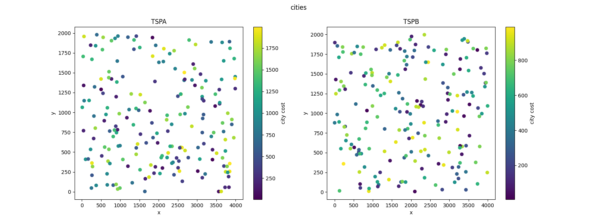
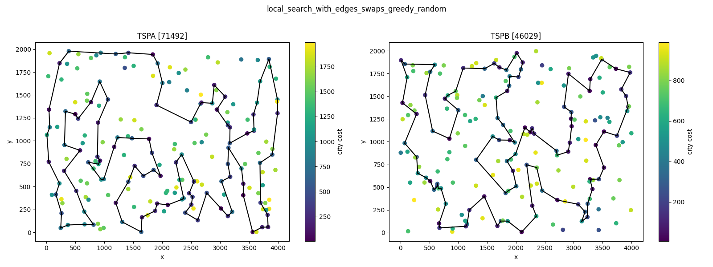
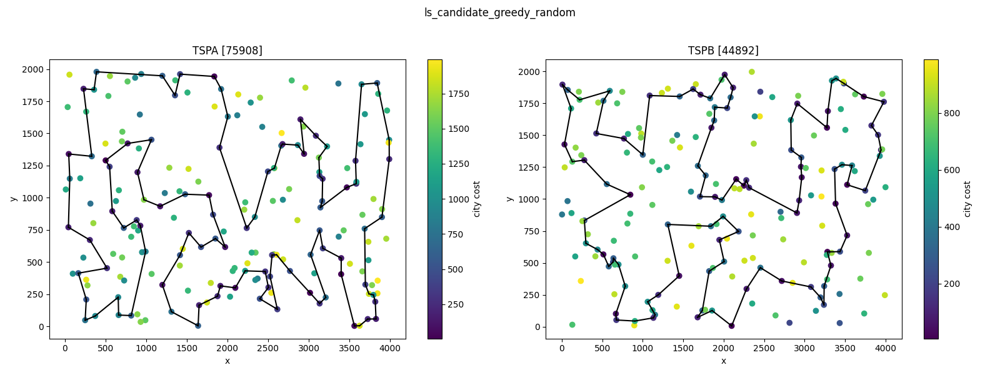
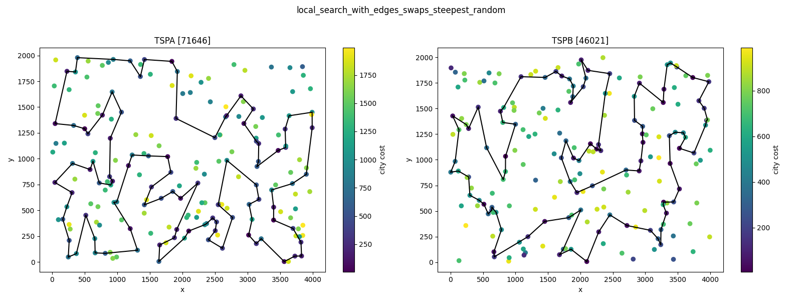

# Raport 3 - Local search [GITHUB](https://github.com/eeryczeek/evolutionary_computing)

Eryk Ptaszyński: 151950  
Eryk Walter: 151931

The **Traveling Salesman Problem (TSP)** is an optimization problem where the objective is to find the shortest possible route that visits a set of cities exactly once and returns to the starting city. In its traditional form, the TSP assumes that the cost of traveling between any two cities is known and fixed, and the salesman must visit all cities.

## Modified TSP Problem with Additional Constraints

1. **Additional City Cost**:  
   In this modified version, each city has an associated **fixed cost** (besides the cost of travel). This city cost represents an additional expense incurred for visiting the city. Therefore, the total cost of the route is the sum of the travel costs between cities and the individual costs for each visited city. The objective becomes minimizing the total of both travel costs and city costs.

2. **Selection of Only 50% of Cities**:  
   Another key modification is that the salesman is not required to visit **all** cities. Instead, the objective is to visit **exactly 50% of the available cities**. This creates a **sub-selection** problem where the salesman must decide which subset of cities to visit while minimizing the total cost (**travel + city cost**).

This visual representation provides an intuitive way to interpret the spatial relationships between cities, their associated fixed costs, and potential travel paths.



<div style="page-break-after: always;"></div>

## [Table of Contents](#table-of-contents)

1. [Modified TSP Problem with Additional Constraints](#modified-tsp-problem-with-additional-constraints)
2. [Combined TSPA and TSPB results table](#combined-tspa-and-tspb-results-table)
3. [Solutions](#solutions)
   - [Local search with edges swaps greedy](#local-search-with-edges-swaps-greedy)
   - [Local search with edges swaps steepest](#local-search-with-edges-swaps-steepest)
   - [Local search with candidate moves greedy](#localsearch-with-candidate-moves-greedy)
   - [Local search with candidate moves steepest](#localsearch-with-candidate-moves-steepest)
4. [Conclusions](#conclusions)

<div style="page-break-after: always;"></div>

## [Combined TSPA and TSPB results table](#combined-tspa-and-tspb-results-table):

Instance TSPA results table:

| **Method**                    | **Min** | **Mean** | **Max** | **Time\* (s)** |
| ----------------------------- | ------- | -------- | ------- | -------------- |
| `ls-edges-swaps-greedy`       | 71492   | 73710    | 76560   | 63.7732        |
| `ls-edges-swaps-steepest`     | 71646   | 73914    | 78738   | 15.9961        |
| `ls-candidate-moves-greedy`   | 75908   | 80351    | 85536   | 35.0503        |
| `ls-candidate-moves-steepest` | 77983   | 86789    | 91227   | 11.6452        |

Instance TSPB results table:

| **Method**                    | **Min** | **Mean** | **Max** | **Time\* (s)** |
| ----------------------------- | ------- | -------- | ------- | -------------- |
| `ls-edges-swaps-greedy`       | 46029   | 48352    | 51147   | 66.4630        |
| `ls-edges-swaps-steepest`     | 46021   | 48303    | 50845   | 16.3699        |
| `ls-candidate-moves-greedy`   | 44892   | 47775    | 50155   | 36.7747        |
| `ls-candidate-moves-steepest` | 47367   | 49457    | 52332   | 12.7428        |

**Time\* - to solve all 200 instances**

## Solutions

```
function getCandidateMoves():
   all_moves <- get neighbourhood with edges swaps
   filtered_moves <- filter out moves with no edge from candidateEdges
   return filtered_moves

function updateSolutionSteepest(): {
   possibleMoves <- getCandidateMoves()
   bestImprovingMove <- map each move to it's deltaCost and take the one with minimal value
   if deltaCost of bestImprovingMove < 0:
      performMove
      return updatedSolution
   else return currentSolution
}
```






## [Conclusions](#conclusions)

Performance of Edge Swaps vs. Candidate Moves:

For both TSPA and TSPB instances, the methods using edge swaps (ls_edges_swaps_greedy_random and ls_edges_swaps_steepest_random) generally performed better in terms of minimum, mean, and maximum costs compared to the methods using candidate moves (ls_candidate_greedy_random and ls_candidate_steepest_random).
This suggests that edge swaps are more effective in finding lower-cost solutions for this modified TSP problem.

Greedy vs. Steepest Descent:

The steepest descent methods (ls_edges_swaps_steepest_random and ls_candidate_steepest_random) consistently achieved lower mean and maximum costs compared to their greedy counterparts (ls_edges_swaps_greedy_random and ls_candidate_greedy_random).
This indicates that the steepest descent approach, which explores all possible moves and selects the best one, is more effective in improving solution quality compared to the greedy approach, which selects the first improving move.

Execution Time:

The greedy methods (ls_edges_swaps_greedy_random and ls_candidate_greedy_random) took significantly longer to solve all 200 instances compared to the steepest descent methods.
For instance, ls_edges_swaps_greedy_random took approximately 63.77 seconds for TSPA and 66.46 seconds for TSPB, whereas ls_edges_swaps_steepest_random took only 15.99 seconds for TSPA and 16.37 seconds for TSPB.
This suggests that while the greedy methods may explore fewer moves, they may still take longer due to the nature of their search strategy.

Impact of Candidate Moves:

The methods using candidate moves (ls_candidate_greedy_random and ls_candidate_steepest_random) generally resulted in higher costs compared to the edge swap methods.
This indicates that while candidate moves can reduce the search space and potentially speed up the search process, they may also limit the ability to find the best possible solutions.

```
Instance: tspa
Method: ls_candidate_greedy_random
Best Solution Path: 69, 108, 117, 0, 143, 183, 89, 23, 137, 94, 124, 148, 33, 9, 62, 102, 49, 144, 14, 138, 32, 178, 106, 52, 55, 185, 40, 165, 7, 164, 27, 90, 81, 196, 31, 13, 56, 113, 175, 171, 88, 16, 78, 145, 92, 57, 129, 25, 44, 120, 2, 125, 152, 1, 75, 86, 101, 97, 121, 53, 180, 154, 135, 70, 127, 123, 162, 151, 133, 79, 63, 80, 176, 51, 59, 197, 115, 46, 139, 193, 41, 42, 43, 116, 65, 149, 112, 4, 84, 190, 10, 177, 54, 184, 160, 34, 146, 22, 159, 18
Best Solution Cost: 75908

Instance: tspa
Method: ls_candidate_steepest_random
Best Solution Path: 90, 81, 196, 157, 31, 113, 175, 171, 16, 25, 44, 120, 75, 101, 1, 97, 152, 74, 2, 129, 78, 145, 92, 57, 55, 52, 178, 106, 185, 40, 165, 138, 14, 49, 102, 62, 9, 37, 148, 94, 176, 80, 79, 63, 86, 53, 180, 154, 135, 70, 127, 123, 161, 162, 133, 151, 51, 109, 59, 197, 65, 149, 112, 177, 54, 34, 181, 42, 160, 184, 43, 77, 116, 5, 96, 115, 60, 46, 139, 142, 41, 193, 159, 22, 18, 108, 93, 117, 0, 143, 183, 89, 23, 137, 186, 144, 21, 7, 164, 27
Best Solution Cost: 77983


Instance: tspb
Method: ls_candidate_greedy_random
Best Solution Path: 122, 90, 51, 147, 6, 188, 169, 132, 161, 70, 3, 15, 145, 13, 195, 168, 139, 11, 138, 33, 160, 29, 0, 109, 35, 106, 124, 62, 18, 55, 34, 170, 152, 183, 140, 4, 149, 28, 20, 60, 148, 47, 94, 179, 185, 99, 130, 95, 86, 166, 194, 176, 113, 103, 127, 89, 163, 153, 81, 77, 141, 91, 36, 61, 21, 82, 8, 111, 144, 104, 25, 177, 5, 45, 142, 78, 175, 162, 80, 190, 136, 73, 54, 31, 193, 117, 198, 156, 1, 121, 131, 135, 102, 63, 100, 40, 107, 72, 10, 133
Best Solution Cost: 44892

Instance: tspb
Method: ls_candidate_steepest_random
Best Solution Path: 168, 11, 138, 33, 104, 8, 82, 111, 29, 0, 35, 109, 189, 155, 152, 170, 34, 55, 18, 62, 124, 106, 95, 130, 183, 140, 149, 28, 20, 60, 148, 47, 94, 66, 179, 185, 86, 166, 194, 176, 180, 113, 103, 127, 89, 163, 153, 77, 141, 61, 36, 177, 5, 78, 175, 45, 80, 190, 136, 73, 164, 54, 31, 193, 117, 198, 156, 42, 27, 38, 16, 197, 1, 131, 135, 102, 63, 40, 122, 90, 125, 121, 51, 191, 133, 10, 178, 147, 134, 6, 188, 65, 169, 132, 13, 70, 3, 15, 145, 195
Best Solution Cost: 47367
```
