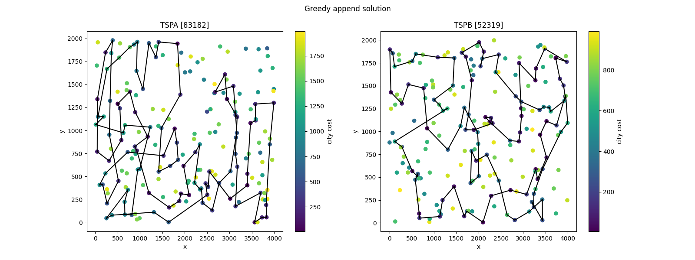
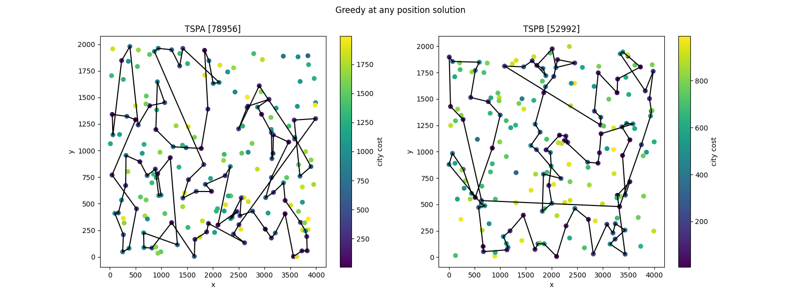

# Raport 1 - Greedy heuristics [GITHUB](https://github.com/eeryczeek/evolutionary_computing)

Eryk Ptaszyński: 151950
Eryk Walter: 151931

The **Traveling Salesman Problem (TSP)** is an optimization problem where the objective is to find the shortest possible route that visits a set of cities exactly once and returns to the starting city. In its traditional form, the TSP assumes that the cost of traveling between any two cities is known and fixed, and the salesman must visit all cities.

## Modified TSP Problem with Additional Constraints

1. **Additional City Cost**:  
   In this modified version, each city has an associated **fixed cost** (besides the cost of travel). This city cost represents an additional expense incurred for visiting the city. Therefore, the total cost of the route is the sum of the travel costs between cities and the individual costs for each visited city. The objective becomes minimizing the total of both travel costs and city costs.

2. **Selection of Only 50% of Cities**:  
   Another key modification is that the salesman is not required to visit **all** cities. Instead, the objective is to visit **exactly 50% of the available cities**. This creates a **sub-selection** problem where the salesman must decide which subset of cities to visit while minimizing the total cost (**travel + city cost**).

This visual representation provides an intuitive way to interpret the spatial relationships between cities, their associated fixed costs, and potential travel paths.


### Instance TSPA results table:

| Algorithm             | Min    | Mean   | Max    |
| --------------------- | ------ | ------ | ------ |
| `random`              | 237008 | 263994 | 294340 |
| `greedy append`       | 83182  | 85108  | 89433  |
| `greedy any position` | 78956  | 81062  | 82916  |
| `greedy cycle`        | 71488  | 72609  | 74410  |

### Instance TSPB results table:

| Algorithm             | Min    | Mean   | Max    |
| --------------------- | ------ | ------ | ------ |
| `random`              | 187379 | 213728 | 240409 |
| `greedy append`       | 52319  | 54390  | 59030  |
| `greedy any position` | 52992  | 55015  | 57460  |
| `greedy cycle`        | 48765  | 51301  | 57324  |

```
function randomSolution(problemInstance, availableCities, currentSolution):
   if currentSolution.path.size equals problemInstance.expectedSolutionLen:
      return currentSolution
   city <- random city from available cities
   append city to currentSolution
   currentSolution.cost += distance(currentSolution.last, city)
   remove city from availableCities
   randomSolution(problemInstance, availableCities, currentSolution)
```


- `TSPA random` **best solution:** `[1 141 62 63 194 55 129 40 144 182 176 45 65 159 23 192 126 198 169 125 101 74 193 100 154 4 41 181 21 22 5 32 123 136 15 96 80 14 16 104 158 151 20 135 145 179 92 120 168 37 86 53 76 0 58 17 139 85 48 184 134 13 42 117 106 68 67 30 152 34 57 46 119 49 138 51 175 107 26 109 9 84 116 191 12 35 64 185 60 187 8 2 121 180 54 50 178 94 3 118]`
- `TSPB random` **best solution:** `[140 70 191 63 92 77 120 117 148 95 185 149 139 177 134 167 53 37 183 75 194 14 154 180 187 51 168 13 31 40 30 78 172 190 195 17 44 38 96 45 159 67 155 58 136 16 113 28 182 179 48 64 137 74 152 138 4 198 80 11 192 112 91 126 9 49 68 141 22 79 151 57 19 100 119 7 20 71 115 121 160 90 97 82 60 101 86 1 25 59 130 176 114 153 56 46 105 106 174 124]`

```
function greedyAppendSolution(problemInstance, availableCities, currentSolution, initialCity):
   if currentSolution.path.size equals problemInstance.expectedSolutionLen:
      return currentSolution
   city <- initialCity if not null, else take the city such that the distance(currentSolution.last, city) is minimal
   append city to currentSolution
   currentSolution.cost += distance(currentSolution.last, city)
   remove city from availableCities
   randomSolution(problemInstance, availableCities, currentSolution)
```



- `TSPA greedy append` **best solution:** `[124 94 63 53 180 154 135 123 65 116 59 115 139 193 41 42 160 34 22 18 108 69 159 181 184 177 54 30 48 43 151 176 80 79 133 162 51 137 183 143 0 117 46 68 93 140 36 163 199 146 195 103 5 96 118 149 131 112 4 84 35 10 190 127 70 101 97 1 152 120 78 145 185 40 165 90 81 113 175 171 16 31 44 92 57 106 49 144 62 14 178 52 55 129 2 75 86 26 100 121]`
- `TSPB greedy append` **best solution:** `[16 1 117 31 54 193 190 80 175 5 177 36 61 141 77 153 163 176 113 166 86 185 179 94 47 148 20 60 28 140 183 152 18 62 124 106 143 0 29 109 35 33 138 11 168 169 188 70 3 145 15 155 189 34 55 95 130 99 22 66 154 57 172 194 103 127 89 137 114 165 187 146 81 111 8 104 21 82 144 160 139 182 25 121 90 122 135 63 40 107 100 133 10 147 6 134 51 98 118 74]`

```
function greedyAtAnyPositionSolution(problemInstance, availableCities, currentSolution, initialCity):
   if currentSolution.path.size equals problemInstance.expectedSolutionLen:
      currentSolution.cost = calculateCost(currentSolution)
      return currentSolution
   city <- initialCity if not null, else:
      for cityInPath in currentSolution.path:
         find city such that the distance(cityInPath, city) is minimal
      take pair (cityInPath, city) such that the distance(cityInPath, city) is minimal
   insert city after cityInPath
   remove city from availableCities
   randomSolution(problemInstance, availableCities, currentSolution)
```



- `TSPA greedy at any position` **best solution:** `[115 68 46 139 41 108 18 146 22 159 193 34 184 190 10 177 30 54 160 181 42 43 116 131 149 65 59 127 84 4 112 123 70 135 154 180 75 86 101 90 165 196 81 119 40 144 148 9 62 14 102 49 178 55 52 106 185 57 129 92 179 145 31 56 113 175 171 16 78 25 44 120 2 1 152 100 26 97 53 124 94 79 63 133 162 151 80 140 93 117 0 143 186 23 89 183 137 176 51 118]`
- `TSPB greedy at any position` **best solution:** `[107 40 63 135 54 113 179 66 94 47 60 148 4 149 28 20 140 183 152 34 55 18 147 6 188 13 132 169 70 15 155 3 145 195 168 139 11 182 138 111 104 21 82 8 144 160 33 29 109 35 0 143 106 124 62 99 130 95 185 86 194 166 176 137 165 127 114 103 89 163 187 153 81 77 141 91 61 36 177 5 45 142 78 175 80 190 193 73 31 27 38 1 198 117 121 51 90 122 133 10]`

```
function greedyCycleSolution(problemInstance, availableCities, currentSolution, initialCity):
   if currentSolution.path.size equals problemInstance.expectedSolutionLen:
      return currentSolution
   city <- initialCity if not null, else:
      for (city1, city2) in sliding pairs from currentSolution.path
         for middleCity in availableCities:
            take minimal triplet (city1, middleCity, city2) such that distance(city1, middleCity) + distance(middleCity, city2) - distance(city1, city2) is minimal
   insert middleCity after city1
   currentSolution.cost += distance(city1, middleCity) + distance(middleCity, city2) - distance(city1, city2)
   remove middleCity from availableCities
   randomSolution(problemInstance, availableCities, currentSolution)
```


- `TSPA greedy cycle` **best solution:** `[0 46 68 139 193 41 115 5 42 181 159 69 108 18 22 146 34 160 48 54 30 177 10 190 4 112 84 35 184 43 116 65 59 118 51 151 133 162 123 127 70 135 180 154 53 100 26 86 75 44 25 16 171 175 113 56 31 78 145 179 92 57 52 185 119 40 196 81 90 165 106 178 14 144 62 9 148 102 49 55 129 120 2 101 1 97 152 124 94 63 79 80 176 137 23 186 89 183 143 117]`
- `TSPB greedy cycle` **best solution:** `[80 162 175 78 142 36 61 91 141 97 187 165 127 89 103 137 114 113 194 166 179 185 99 130 22 66 94 47 148 60 20 28 149 4 140 183 152 170 34 55 18 62 124 106 128 95 86 176 180 163 153 81 77 21 87 82 8 56 144 111 0 35 109 29 160 33 49 11 43 134 147 6 188 169 132 13 161 70 3 15 145 195 168 139 182 138 104 25 177 5 45 136 73 164 31 54 117 198 193 190]`

### Conclusions

**Performance Comparison:**
The `random` algorithm consistently performs the worst across both instances, with the highest **minimum**, **mean**, and **maximum** values.
The `greedy cycle` algorithm consistently performs the best, achieving the lowest **minimum**, **mean**, and **maximum** values in both instances.

**Algorithm Efficiency:**
The `greedy append` and `greedy any position` algorithms perform significantly better than the random algorithm but are outperformed by the `greedy cycle` algorithm.
The `greedy cycle` algorithm shows a noticeable improvement over the other greedy algorithms, indicating its superior efficiency in finding shorter paths.

**Consistency:**
The `greedy cycle` algorithm not only provides the best results but also shows a smaller range between the minimum and maximum values, indicating more consistent performance.
The random algorithm shows the largest range between the minimum and maximum values, indicating high variability and inconsistency in its performance.

**Instance Comparison:**
For both instances, the order of algorithm performance remains the same: `greedy cycle` > `greedy any position` > `greedy append` > `random`.
The absolute values differ between instances, but the relative performance of the algorithms remains consistent.
