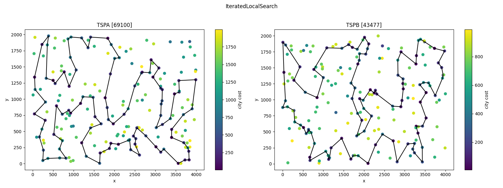
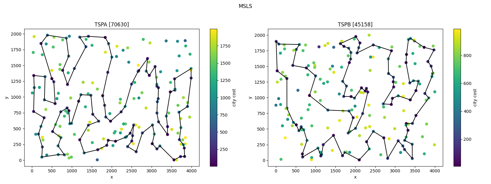

# Raport - Iterated Local Search [GITHUB](https://github.com/eeryczeek/evolutionary_computing)

Eryk Ptaszyński: 151950  
Eryk Walter: 151931

The **Traveling Salesman Problem (TSP)** is an optimization problem where the objective is to find the shortest possible route that visits a set of cities exactly once and returns to the starting city. In its traditional form, the TSP assumes that the cost of traveling between any two cities is known and fixed, and the salesman must visit all cities.

## Modified TSP Problem with Additional Constraints

1. **Additional City Cost**:  
   In this modified version, each city has an associated **fixed cost** (besides the cost of travel). This city cost represents an additional expense incurred for visiting the city. Therefore, the total cost of the route is the sum of the travel costs between cities and the individual costs for each visited city. The objective becomes minimizing the total of both travel costs and city costs.

2. **Selection of Only 50% of Cities**:  
   Another key modification is that the salesman is not required to visit **all** cities. Instead, the objective is to visit **exactly 50% of the available cities**. This creates a **sub-selection** problem where the salesman must decide which subset of cities to visit while minimizing the total cost (**travel + city cost**).

This visual representation provides an intuitive way to interpret the spatial relationships between cities, their associated fixed costs, and potential travel paths.


<div style="page-break-after: always;"></div>

## [Table of Contents](#table-of-contents)

1. [Modified TSP Problem with Additional Constraints](#modified-tsp-problem-with-additional-constraints)
2. [Combined TSPA and TSPB results table](#combined-tspa-and-tspb-results-table)
3. [Solutions](#solutions)
   - [IteratedLocalSearch]
   - [MSLS]
   - [GreedyAtAnyPosition]
   - [ListOfImprovingMoves]
4. [Conclusions](#conclusions)

<div style="page-break-after: always;"></div>

## [Combined TSPA and TSPB results table](#combined-tspa-and-tspb-results-table):

Instance: tspa

| **Method**             | **Min** | **Mean** | **Max** | **Time\* (s)** |
| ---------------------- | ------- | -------- | ------- | -------------- |
| `IteratedLocalSearch`  | 69353   | 70514    | 71980   | 78.2629        |
| `MSLS`                 | 71299   | 72745    | 74026   | 71.1501        |
| `GreedyAtAnyPosition`  | 71263   | 73096    | 76156   | 0.8800         |
| `ListOfImprovingMoves` | 71564   | 73810    | 77544   | 3.8895         |

**IteratedLocalSearch: ~226 iterations of LocalSearch**

Instance: tspb

| **Method**             | **Min** | **Mean** | **Max** | **Time\* (s)** |
| ---------------------- | ------- | -------- | ------- | -------------- |
| `IteratedLocalSearch`  | 43869   | 45008    | 46892   | 78.1519        |
| `MSLS`                 | 46053   | 47473    | 48854   | 68.7576        |
| `GreedyAtAnyPosition`  | 44446   | 45916    | 51960   | 0.6027         |
| `ListOfImprovingMoves` | 45404   | 48409    | 51581   | 3.6014         |

**IteratedLocalSearch: ~226 iterations of LocalSearch**

**Time\* - to solve all 200 instances**

## Solutions

```
Perturbation(Triplet, Pair, city)

function generatePerturbation():
    triplet <- random triplet from consecutive triplets from solution.path
    pair <- random pair from consecutive pairs from solution.path
    city <- random city from available cities
    perturbation = Perturbation(triplet, pair, city)

function applyPerturbation(solution, perturbation):
    remove perturbation.triplet.city2 from the solution
    add perturbation.city between the two cities from perturbation.pair
    return perturbedSolution

function perturbSolution():
    do:
        perturbation <- generatePerturbation()
        solution <- applyPerturbation(solution, perturbation)
    twice
```





## [Conclusions](#conclusions)

For both TSPA and TSPB instances, IteratedLocalSearch consistently achieved lower minimum, mean, and maximum costs compared to MSLS. This suggests that IteratedLocalSearch is more effective in finding lower-cost solutions for this modified TSP problem.

### Execution Time

The execution time for IteratedLocalSearch is slightly higher than MSLS for both TSPA and TSPB instances. However, the difference in execution time is relatively small compared to the improvement in solution quality.

### Summary

IteratedLocalSearch outperforms MSLS in terms of solution quality, achieving lower costs for both TSPA and TSPB instances. While IteratedLocalSearch takes slightly longer to execute, the trade-off is justified by the significant improvement in solution quality.

```
Instance: tspa
Method: IteratedLocalSearch
Best Solution Path: 154, 180, 53, 121, 100, 26, 86, 75, 101, 1, 97, 152, 2, 120, 44, 25, 16, 171, 175, 113, 56, 31, 78, 145, 92, 129, 57, 179, 196, 81, 90, 165, 40, 185, 55, 52, 106, 178, 49, 14, 144, 62, 9, 148, 124, 94, 63, 79, 80, 176, 137, 23, 186, 89, 183, 143, 0, 117, 93, 140, 108, 69, 18, 22, 146, 159, 193, 41, 139, 68, 46, 115, 59, 118, 51, 151, 133, 162, 149, 65, 116, 43, 42, 181, 34, 160, 48, 54, 177, 10, 190, 184, 35, 84, 4, 112, 123, 127, 70, 135
Best Solution Cost: 69353

Instance: tspa
Method: MSLS
Best Solution Path: 9, 148, 102, 49, 178, 106, 52, 55, 57, 179, 145, 78, 92, 129, 2, 152, 94, 63, 122, 79, 80, 176, 137, 89, 183, 143, 0, 117, 93, 140, 108, 69, 18, 159, 22, 146, 181, 34, 160, 48, 30, 54, 184, 177, 10, 4, 112, 127, 123, 162, 149, 131, 65, 116, 43, 42, 5, 41, 193, 139, 68, 46, 198, 115, 59, 118, 51, 151, 133, 135, 70, 154, 180, 53, 100, 26, 97, 1, 101, 86, 75, 120, 44, 25, 16, 171, 175, 113, 56, 31, 196, 81, 90, 119, 40, 185, 165, 14, 144, 62
Best Solution Cost: 71299

Instance: tspa
Method: GreedyAtAnyPosition
Best Solution Path: 68, 46, 115, 139, 193, 41, 5, 42, 181, 159, 69, 108, 18, 22, 146, 34, 160, 48, 54, 177, 10, 190, 4, 112, 84, 35, 184, 43, 116, 65, 59, 118, 51, 151, 133, 162, 123, 127, 70, 135, 180, 154, 53, 100, 26, 86, 75, 44, 25, 16, 171, 175, 113, 56, 31, 78, 145, 179, 92, 57, 52, 185, 119, 40, 196, 81, 90, 165, 106, 178, 14, 144, 62, 9, 148, 102, 49, 55, 129, 120, 2, 101, 1, 97, 152, 124, 94, 63, 79, 80, 176, 137, 23, 186, 89, 183, 0, 143, 117, 93
Best Solution Cost: 71263

Instance: tspa
Method: ListOfImprovingMoves
Best Solution Path: 117, 0, 143, 183, 89, 23, 137, 15, 62, 9, 148, 49, 102, 144, 14, 3, 178, 106, 52, 55, 185, 40, 119, 165, 164, 7, 27, 90, 81, 196, 31, 113, 175, 171, 16, 78, 145, 179, 57, 92, 129, 25, 44, 120, 2, 75, 86, 101, 1, 97, 152, 94, 26, 100, 53, 180, 154, 135, 70, 127, 123, 162, 151, 133, 79, 63, 122, 80, 176, 51, 118, 59, 149, 65, 116, 115, 139, 46, 68, 193, 41, 181, 43, 42, 160, 184, 84, 112, 4, 190, 10, 177, 54, 34, 22, 159, 18, 69, 108, 93
Best Solution Cost: 71742


Instance: tspb
Method: IteratedLocalSearch
Best Solution Path: 141, 91, 61, 36, 177, 5, 78, 175, 45, 80, 190, 136, 73, 54, 31, 193, 117, 198, 156, 1, 16, 27, 38, 135, 63, 100, 40, 107, 133, 122, 90, 131, 121, 51, 147, 6, 188, 169, 132, 13, 70, 3, 15, 145, 195, 168, 139, 11, 138, 33, 160, 104, 8, 111, 144, 29, 0, 109, 35, 143, 106, 124, 62, 18, 55, 34, 170, 152, 183, 140, 4, 149, 28, 20, 60, 148, 47, 94, 66, 179, 185, 99, 130, 95, 86, 166, 194, 176, 113, 26, 103, 114, 137, 127, 89, 163, 187, 153, 81, 77
Best Solution Cost: 43869

Instance: tspb
Method: MSLS
Best Solution Path: 11, 138, 182, 139, 168, 195, 13, 145, 15, 3, 70, 161, 132, 169, 188, 6, 147, 51, 121, 131, 90, 122, 40, 107, 63, 102, 135, 38, 27, 16, 197, 1, 156, 198, 117, 193, 31, 54, 73, 190, 80, 175, 78, 142, 5, 177, 8, 82, 21, 61, 36, 141, 97, 77, 81, 153, 187, 163, 89, 127, 114, 103, 26, 113, 176, 194, 166, 86, 95, 130, 99, 185, 22, 179, 94, 47, 148, 60, 28, 20, 183, 140, 152, 34, 55, 18, 62, 124, 106, 159, 143, 35, 109, 0, 29, 160, 144, 104, 33, 49
Best Solution Cost: 46053

Instance: tspb
Method: GreedyAtAnyPosition
Best Solution Path: 40, 107, 100, 63, 122, 135, 38, 27, 16, 1, 156, 198, 117, 54, 31, 193, 73, 136, 190, 80, 162, 175, 78, 142, 45, 5, 177, 36, 61, 91, 141, 77, 81, 153, 187, 163, 89, 127, 137, 114, 103, 113, 180, 176, 194, 166, 86, 95, 130, 99, 22, 185, 179, 66, 94, 47, 148, 60, 20, 28, 149, 4, 140, 183, 152, 170, 34, 55, 18, 62, 124, 106, 143, 35, 109, 0, 29, 160, 33, 138, 182, 11, 139, 168, 195, 145, 15, 3, 70, 13, 132, 169, 188, 6, 147, 191, 90, 51, 121, 131
Best Solution Cost: 44446

Instance: tspb
Method: ListOfImprovingMoves
Best Solution Path: 130, 99, 179, 172, 66, 94, 47, 148, 60, 23, 20, 28, 199, 9, 183, 140, 152, 34, 55, 18, 62, 124, 106, 143, 35, 0, 109, 29, 168, 195, 145, 3, 15, 70, 169, 188, 147, 71, 51, 121, 90, 131, 122, 133, 10, 107, 40, 100, 63, 102, 135, 38, 27, 1, 198, 117, 193, 31, 54, 164, 73, 136, 190, 80, 45, 175, 78, 5, 25, 138, 33, 160, 144, 104, 8, 111, 82, 87, 21, 177, 36, 61, 91, 141, 77, 81, 153, 187, 163, 89, 127, 103, 114, 113, 176, 194, 166, 86, 185, 95
Best Solution Cost: 46822
```
