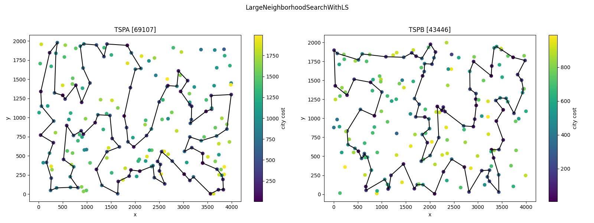

# Raport - Iterated Local Search [GITHUB](https://github.com/eeryczeek/evolutionary_computing)

Eryk Ptaszyński: 151950  
Eryk Walter: 151931

The **Traveling Salesman Problem (TSP)** is an optimization problem where the objective is to find the shortest possible route that visits a set of cities exactly once and returns to the starting city. In its traditional form, the TSP assumes that the cost of traveling between any two cities is known and fixed, and the salesman must visit all cities.

## Modified TSP Problem with Additional Constraints

1. **Additional City Cost**:  
   In this modified version, each city has an associated **fixed cost** (besides the cost of travel). This city cost represents an additional expense incurred for visiting the city. Therefore, the total cost of the route is the sum of the travel costs between cities and the individual costs for each visited city. The objective becomes minimizing the total of both travel costs and city costs.

2. **Selection of Only 50% of Cities**:  
   Another key modification is that the salesman is not required to visit **all** cities. Instead, the objective is to visit **exactly 50% of the available cities**. This creates a **sub-selection** problem where the salesman must decide which subset of cities to visit while minimizing the total cost (**travel + city cost**).

This visual representation provides an intuitive way to interpret the spatial relationships between cities, their associated fixed costs, and potential travel paths.


<div style="page-break-after: always;"></div>

## [Table of Contents](#table-of-contents)

1. [Modified TSP Problem with Additional Constraints](#modified-tsp-problem-with-additional-constraints)
2. [Combined TSPA and TSPB results table](#combined-tspa-and-tspb-results-table)
3. [Solutions](#solutions)
   - [IteratedLocalSearch]
   - [MSLS]
   - [GreedyAtAnyPosition]
   - [ListOfImprovingMoves]
4. [Conclusions](#conclusions)

<div style="page-break-after: always;"></div>

## [Combined TSPA and TSPB results table](#combined-tspa-and-tspb-results-table):


### Instance: **tspa**

| **Method**                     | **Min**         | **Mean**        | **Max**         | **Avg time (s)**     | **Iterations**  |
| ------------------------------ | --------------- | --------------- | --------------- | -------------------- | --------------- |
| `InsertAnyPositionSolution`    | 71263           | 73229           | 76156           | 0.0240               | -               |
| `MSLS`                         | 70630           | 71164           | 71554           | 21.6870              | -               |
| `LargeNeighborhoodSearchWithLS` | 69107           | 69496           | 70330           | 22.2230              | 1497            |
| `LargeNeighborhoodSearchWithoutLS` | 69166           | 69645           | 70068           | 22.2190              | 2518            |
| `IteratedLocalSearch`          | 69100           | 69590           | 70046           | 22.1530              | 2808            |

---

### Instance: **tspb**

| **Method**                     | **Min**         | **Mean**        | **Max**         | **Avg time (s)**     | **Iterations**  |
| ------------------------------ | --------------- | --------------- | --------------- | -------------------- | --------------- |
| `InsertAnyPositionSolution`    | 44446           | 46246           | 52152           | 0.0210               | -               |
| `MSLS`                         | 45158           | 45658           | 46156           | 22.3800              | -               |
| `LargeNeighborhoodSearchWithLS` | 43446           | 44108           | 44926           | 22.2240              | 1468            |
| `LargeNeighborhoodSearchWithoutLS` | 43448           | 44293           | 45314           | 22.2190              | 2468            |
| `IteratedLocalSearch`          | 43477           | 44088           | 44700           | 22.1520              | 2902            |

--- 

## Solutions

```
function destroy(solution):
    remove 30 cities radomly (uniform distribution) from the solution

function repair(solution):
    perform greedy at any position algorithm on the solution

function local_search(solution) = SteepestLocalSearch with Node swaps

function LargeNeighborhoodSearchWithLS(solution):
    cur_solution = local_search(solution)
    until 22 seconds have passed:
        new_solution = destroy(solution)
        new_solution = repair(new_solution)
        new_solution = local_search(new_solution)
        if new_solution.cost < cur_solution.cost:
            cur_solution = new_solution
    return cur_solution

function LargeNeighborhoodSearchWithoutLS(solution):
    cur_solution = local_search(solution)
    until 33 seconds have passed:
        new_solution = destroy(solution)
        new_solution = repair(new_solution)
        if new_solution.cost < cur_solution.cost:
            cur_solution = new_solution
    return cur_solution
```




## [Conclusions](#conclusions)

For both TSPA and TSPB instances, the results from LNS are similar to ILS but slitghtly worse. Experiments also showed that the LNS with LS is only marginally better than LNS without LS. The MSLS method is the worst in terms of solution quality, which was expected. It is possible that more sophisticated destroy method could improve the results but from other similiarly complicated functions this works the best.

### Summary

Considering the results of the experiments, version of LNS without LS is the simplest and yet very powerful method for solving TSP-like problems.

```
Instance: tspa
Method: InsertAnyPositionSolution
Best Solution Path: 68, 46, 115, 139, 193, 41, 5, 42, 181, 159, 69, 108, 18, 22, 146, 34, 160, 48, 54, 177, 10, 190, 4, 112, 84, 35, 184, 43, 116, 65, 59, 118, 51, 151, 133, 162, 123, 127, 70, 135, 180, 154, 53, 100, 26, 86, 75, 44, 25, 16, 171, 175, 113, 56, 31, 78, 145, 179, 92, 57, 52, 185, 119, 40, 196, 81, 90, 165, 106, 178, 14, 144, 62, 9, 148, 102, 49, 55, 129, 120, 2, 101, 1, 97, 152, 124, 94, 63, 79, 80, 176, 137, 23, 186, 89, 183, 0, 143, 117, 93
Best Solution Cost: 71263

Instance: tspa
Method: MSLS
Best Solution Path: 176, 80, 79, 63, 94, 124, 148, 9, 62, 144, 102, 49, 14, 178, 106, 52, 55, 57, 92, 78, 145, 179, 185, 40, 119, 165, 27, 90, 81, 196, 157, 31, 56, 113, 175, 171, 16, 25, 44, 120, 82, 129, 2, 75, 86, 101, 1, 152, 97, 26, 100, 53, 180, 154, 135, 127, 123, 162, 133, 151, 51, 118, 59, 149, 131, 65, 116, 43, 184, 35, 84, 112, 4, 10, 177, 54, 48, 160, 34, 146, 22, 159, 181, 42, 41, 193, 18, 108, 140, 68, 139, 115, 46, 0, 117, 143, 183, 89, 23, 137
Best Solution Cost: 70630

Instance: tspa
Method: LargeNeighborhoodSearchWithLS
Best Solution Path: 42, 43, 116, 65, 59, 118, 51, 151, 133, 162, 123, 127, 70, 135, 154, 180, 53, 100, 26, 86, 75, 101, 1, 97, 152, 2, 120, 44, 25, 16, 171, 175, 113, 56, 31, 78, 145, 92, 129, 57, 179, 196, 81, 90, 165, 119, 40, 185, 55, 52, 106, 178, 49, 14, 144, 102, 62, 9, 148, 124, 94, 63, 79, 80, 176, 137, 23, 186, 89, 183, 143, 0, 117, 93, 140, 68, 46, 115, 139, 41, 193, 159, 69, 108, 18, 22, 146, 181, 34, 160, 48, 54, 177, 10, 190, 4, 112, 84, 35, 184
Best Solution Cost: 69107

Instance: tspa
Method: LargeNeighborhoodSearchWithoutLS
Best Solution Path: 90, 81, 196, 31, 56, 113, 175, 171, 16, 78, 145, 179, 57, 92, 129, 25, 44, 120, 2, 152, 97, 1, 101, 75, 86, 26, 100, 53, 180, 154, 135, 70, 127, 123, 162, 133, 151, 51, 118, 59, 65, 116, 43, 42, 184, 35, 84, 112, 4, 190, 10, 177, 54, 48, 160, 34, 181, 146, 22, 18, 108, 69, 159, 193, 41, 139, 115, 46, 68, 140, 93, 117, 0, 143, 183, 89, 186, 23, 137, 176, 80, 79, 63, 94, 124, 148, 9, 62, 102, 144, 14, 49, 178, 106, 52, 55, 185, 40, 119, 165
Best Solution Cost: 69166

Instance: tspa
Method: IteratedLocalSearch
Best Solution Path: 135, 70, 127, 123, 162, 133, 151, 51, 118, 59, 65, 116, 43, 42, 184, 35, 84, 112, 4, 190, 10, 177, 54, 48, 160, 34, 181, 146, 22, 18, 108, 69, 159, 193, 41, 139, 115, 46, 68, 140, 93, 117, 0, 143, 183, 89, 186, 23, 137, 176, 80, 79, 63, 94, 124, 148, 9, 62, 102, 144, 14, 49, 178, 106, 52, 55, 57, 129, 92, 179, 185, 40, 119, 165, 90, 81, 196, 145, 78, 31, 56, 113, 175, 171, 16, 25, 44, 120, 2, 152, 97, 1, 101, 75, 86, 26, 100, 53, 180, 154
Best Solution Cost: 69100


Instance: tspb
Method: InsertAnyPositionSolution
Best Solution Path: 40, 107, 100, 63, 122, 135, 38, 27, 16, 1, 156, 198, 117, 54, 31, 193, 73, 136, 190, 80, 162, 175, 78, 142, 45, 5, 177, 36, 61, 91, 141, 77, 81, 153, 187, 163, 89, 127, 137, 114, 103, 113, 180, 176, 194, 166, 86, 95, 130, 99, 22, 185, 179, 66, 94, 47, 148, 60, 20, 28, 149, 4, 140, 183, 152, 170, 34, 55, 18, 62, 124, 106, 143, 35, 109, 0, 29, 160, 33, 138, 182, 11, 139, 168, 195, 145, 15, 3, 70, 13, 132, 169, 188, 6, 147, 191, 90, 51, 121, 131
Best Solution Cost: 44446

Instance: tspb
Method: MSLS
Best Solution Path: 94, 154, 47, 148, 60, 20, 28, 149, 4, 140, 183, 95, 130, 99, 185, 86, 128, 124, 106, 143, 62, 18, 55, 34, 170, 152, 155, 145, 15, 3, 70, 188, 169, 132, 13, 195, 168, 139, 11, 138, 33, 160, 29, 0, 109, 35, 111, 82, 21, 8, 104, 25, 121, 51, 90, 122, 133, 10, 107, 40, 63, 135, 1, 198, 117, 193, 31, 54, 73, 136, 190, 80, 45, 175, 78, 5, 177, 36, 61, 141, 97, 77, 81, 153, 187, 163, 89, 127, 137, 114, 103, 26, 113, 180, 176, 194, 166, 172, 179, 66
Best Solution Cost: 45158

Instance: tspb
Method: LargeNeighborhoodSearchWithLS
Best Solution Path: 141, 91, 61, 36, 177, 5, 78, 175, 142, 45, 80, 190, 136, 73, 54, 31, 193, 117, 198, 156, 1, 131, 121, 51, 90, 122, 135, 63, 40, 107, 133, 10, 147, 6, 188, 169, 132, 70, 3, 15, 145, 13, 195, 168, 139, 11, 138, 33, 160, 144, 104, 8, 21, 82, 111, 29, 0, 109, 35, 143, 106, 124, 62, 18, 55, 34, 170, 152, 183, 140, 4, 149, 28, 20, 60, 148, 47, 94, 66, 179, 22, 99, 130, 95, 185, 86, 166, 194, 176, 113, 114, 137, 127, 89, 103, 163, 187, 153, 81, 77
Best Solution Cost: 43446

Instance: tspb
Method: LargeNeighborhoodSearchWithoutLS
Best Solution Path: 80, 190, 136, 73, 54, 31, 193, 117, 198, 156, 1, 16, 27, 38, 63, 40, 107, 133, 122, 135, 131, 121, 51, 90, 147, 6, 188, 169, 132, 70, 3, 15, 145, 13, 195, 168, 139, 11, 138, 33, 160, 144, 104, 8, 111, 29, 0, 109, 35, 143, 106, 124, 62, 18, 55, 34, 170, 152, 183, 140, 4, 149, 28, 20, 60, 148, 47, 94, 66, 179, 22, 99, 130, 95, 185, 86, 166, 194, 176, 113, 114, 137, 127, 89, 103, 163, 187, 153, 81, 77, 141, 91, 61, 36, 177, 5, 78, 175, 142, 45
Best Solution Cost: 43448

Instance: tspb
Method: IteratedLocalSearch
Best Solution Path: 38, 63, 40, 107, 122, 135, 131, 121, 51, 90, 147, 6, 188, 169, 132, 70, 3, 15, 145, 13, 195, 168, 139, 11, 138, 104, 8, 21, 82, 111, 144, 33, 160, 29, 0, 109, 35, 143, 106, 124, 62, 18, 55, 34, 170, 152, 183, 140, 4, 149, 28, 20, 60, 148, 47, 94, 66, 179, 99, 130, 95, 185, 86, 166, 194, 176, 113, 114, 137, 127, 89, 103, 163, 187, 153, 81, 77, 141, 91, 61, 36, 177, 5, 78, 175, 142, 45, 80, 190, 136, 73, 54, 31, 193, 117, 198, 156, 1, 16, 27
Best Solution Cost: 43477
```
