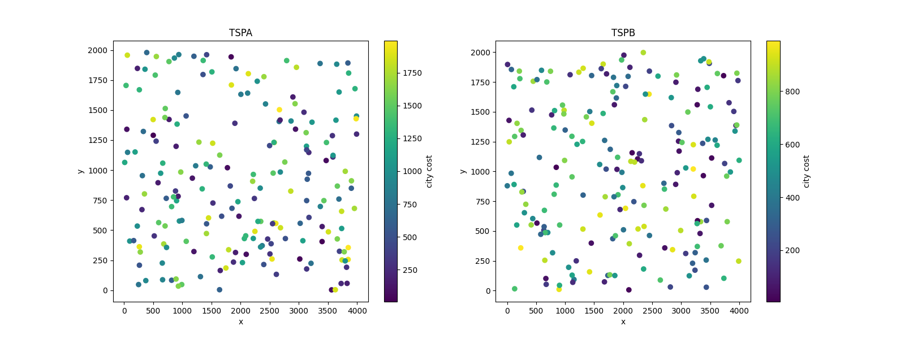
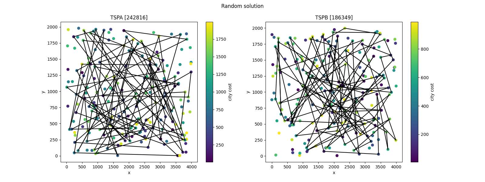
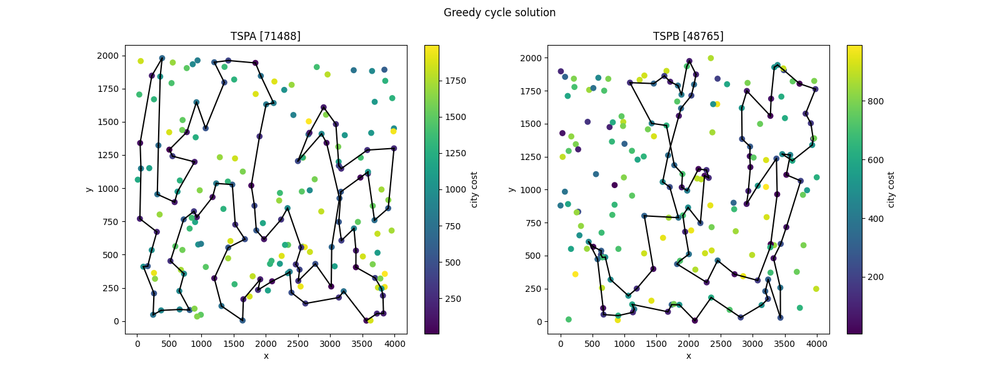

# Raport 1 - Greedy heuristics

Eryk Ptaszyński 151950
Eryk Walter 1519XX

The **Traveling Salesman Problem (TSP)** is an optimization problem where the objective is to find the shortest possible route that visits a set of cities exactly once and returns to the starting city. In its traditional form, the TSP assumes that the cost of traveling between any two cities is known and fixed, and the salesman must visit all cities.

## Modified TSP Problem with Additional Constraints

1. **Additional City Cost**:  
   In this modified version, each city has an associated **fixed cost** (besides the cost of travel). This city cost represents an additional expense incurred for visiting the city. Therefore, the total cost of the route is the sum of the travel costs between cities and the individual costs for each visited city. The objective becomes minimizing the total of both travel costs and city costs.

2. **Selection of Only 50% of Cities**:  
   Another key modification is that the salesman is not required to visit **all** cities. Instead, the objective is to visit **exactly 50% of the available cities**. This creates a **sub-selection** problem where the salesman must decide which subset of cities to visit while minimizing the total cost (**travel + city cost**).

This visual representation provides an intuitive way to interpret the spatial relationships between cities, their associated fixed costs, and potential travel paths.

### Instance TSPA results table:

| Algorithm             | Min    | Mean   | Max    |
| --------------------- | ------ | ------ | ------ |
| `random`              | 237008 | 263994 | 294340 |
| `greedy append`       | 83182  | 85108  | 89433  |
| `greedy any position` | 78956  | 81062  | 82916  |
| `greedy cycle`        | 71488  | 72609  | 74410  |

### Instance TSPB results table:

| Algorithm             | Min    | Mean   | Max    |
| --------------------- | ------ | ------ | ------ |
| `random`              | 187379 | 213728 | 240409 |
| `greedy append`       | 52319  | 54390  | 59030  |
| `greedy any position` | 52992  | 55024  | 57460  |
| `greedy cycle`        | 48765  | 51301  | 57324  |

### Challenges and Considerations

- **Subset Selection**: The decision to visit only 50% of the cities introduces a combinatorial complexity because the algorithm must evaluate many possible subsets of cities and their associated costs.
- **Trade-off between Travel Cost and City Cost**: Some cities may have high travel costs but low fixed costs, while others may have the reverse. The algorithm must find an optimal balance to minimize the overall cost.

- **Sub-tour Elimination**: As in standard TSP, sub-tours (tours that don't visit all selected cities) need to be eliminated to ensure that the salesman forms a valid route.

### Application Areas

This modified TSP problem can model real-world scenarios such as:

- Delivery services where only a subset of clients must be visited, with each client having a fixed handling or service fee.
- Route planning in logistics where only half of the distribution centers are needed to be visited, and each visit incurs an overhead cost.
- Travel planning for minimizing expenses by choosing affordable destinations and minimizing travel distance.
